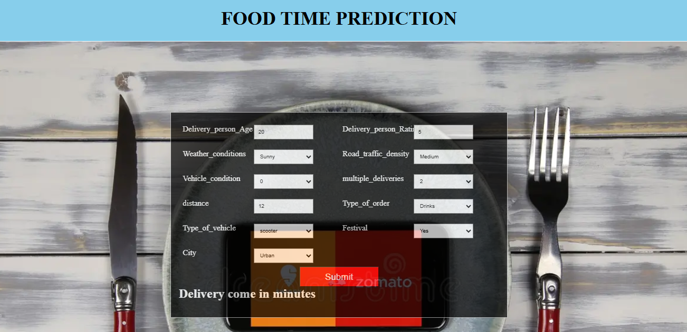

# Food-Delivery-Time-Prediction
Use of Machine Learning to Predict the food delivery time


## 1. Create a new environment
```
conda create food_env python=3.9 -y
```

## 2. Activate the new environment

```
conda activate food_env
```

## 3. Install requiremnets file
```
pip install -r requirements.txt
```

# Problem Statement

Food Delivery services like Uber Eats or Rappi need to show the accurate time it will take to deliver your order to keep transparency with their customers. These companies use Machine Learning algorithms to predict the food delivery time based on how much time the delivery partners took for the same distance in the past.

To predict the food delivery time in real-time, we need to calculate the distance between the food preparation point and the point of food consumption. After finding the distance between the restaurant and the delivery locations, we need to find relationships between the time taken by delivery partners to deliver the food in the past for the same distance.

# Analysis Summary

1. The data set consists of 20 columns of which 11 are categorical and 9 are numerical.

2. Data type transformations must be done in the case of the Order Date column

3. New temporary columns are created, which are 'TimeOrder_Hour', 'TimeOrder_min', 'Time_Order_picked_Hour', 'Time_Order_picked_min', 'Delivery_city' based on previous columns

4. To visualize the data, Plotly was implemented.


The map shows latitude and longitude points related to order picked and delivered

5. Calculate the distance between 2 points
Haversine equation was implemented:

$$
a = \sin^2\left(\frac{\Delta \varphi}{2}\right) + \cos(\varphi_1) \cdot \cos(\varphi_2) \cdot \sin^2\left(\frac{\Delta \lambda}{2}\right)
$$

$$
c = 2 \cdot \text{atan2}\left(\sqrt{a}, \sqrt{1-a}\right)
$$

$$
d = R \cdot c
$$

Where:

- $$\varphi_1$$ y $$\varphi_2$$ son las latitudes de los dos puntos (en radianes),
- $$\lambda_1$$ y $$\lambda_2$$ son las longitudes de los dos puntos (en radianes),
- $$\Delta \varphi = \varphi_2 - \varphi_1$$ es la diferencia entre las latitudes,
- $$\Delta \lambda = \lambda_2 - \lambda_1$$ es la diferencia entre las longitudes,
- $$R$$ es el radio de la Tierra (usualmente 6,371 km),
- $$d$$ es la distancia entre los dos puntos.

6. A new column called distance was created

## Visualization

- The minimum distance between points


- Max distance between points


- City count:

cities like: Pune, Mumbai, Mysore, hyderabaad , chennai, banglore, indore, are more food ordered cities.

- Road Traffic


- Plotting a countplot of Festival and bar plot w.r.t median time taken min


- Person rating vs Age

Older persons have worse ratings

# Model Building

1. Standardization techniques were used to avoid overfitting of the model, in addition, for certain categorical variables onehot and ordinal encoding were used.

## Ordinal encoding

The OrdinalEncoder can be used if you can order / rank your independent variables, e.g., small, medium, large, very large. This is also not intended to be used on your dependent variables.

## One hot Encoder

OneHotEncoder can be used for transforming your independent variables according to how one-hot-encoding works. It is not really intended to be used on your dependent variables.

2. Once the data is prepared for modeling, certain columns unnecessary for the implementation are eliminated.

3. Scikit-learn Pipeline is implemented.

4. the model is training with these regression algorithms:
Random Forest Regressor, Decision Tree Regressor, Gradient boosting, linear regression, Ridge Regression, XGBRegressor.

5. These metrics was used to check the model performance:
R2 Score, MSE, RMSE, MAE

6. The best model was XGB Regressor.

## Modular Coding
I implement modular coding to improve the organization, scalability, and maintainability of Machine Learning solution.
I use classes and objects to build the complete Machine Learning Pipeline


## Flask Deployment

A small flask API was developed. The functionality of the application can be tested through this API.


